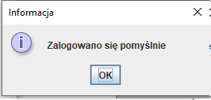

# Czat sieciowy (02.2021)
Bardzo prosta bazodanowa aplikacja typu klient-serwer umożliwiająca użytkownikowi wymianę tekstowych wiadomości z innymi użytkownikami w czasie rzeczywistym.

## Wymagania funkcjonalne:
* Logowanie,
* Rejestracja,
* Wyszukiwanie użytkowników,
* Wysyłanie wiadomości do danych użytkowników.

## Szczegóły działania aplikacji:
Aplikacja jest wielowątkowa i można wyróżnić następujące wątki: serwer, klient oraz obsługa klienta. Komunikacja między klientem i serwerem jest zrealizowana poprzez Sockety. Tworzone jest jedno gniazdko serwerowe, osobne gniazdka dla każdego klienta oraz osobne dla obsługi klienta. Do komunikacji między klientem i serwerem zaimplementowano system komend. Np. klient wysyła do serwera wiadomość ``logout#id``, którą serwer zinterpretuje jako żądanie wylogowania. Do poprawnego działania aplikacji potrzebne jest uruchomienie jednej instancji serwera (plik jar) oraz następnie dowolnej liczby instancji klientów (również plik jar).

## Technologie:
* GUI - Java (biblioteka Swing),
* Klient oraz Serwer - Java,
* Łączenie z bazą danych - JDBC,
* Baza danych - MySQL.

# Zrzuty ekranu:

Okno logowania:

Zakładanie konta:

Widok po zalogowaniu:

W aplikacji jest zrealizowany mechanizm walidacji np. w przypadku nie wprowadzenia danych, zostanie wyświetlony adekwatny komunikat np.:

W przypadku pomyślnego logowania albo rejestracji są wyświetlane odpowiednie komunikaty np.:

